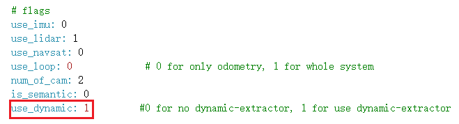
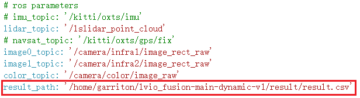
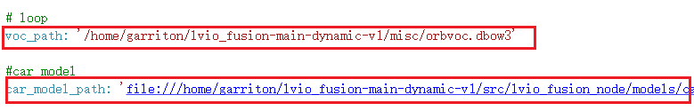
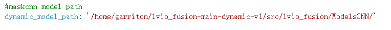
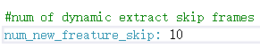

# 动态目标消除

1. #### 准备工作

该动态目标消除代码使用OpenCV的dnn module，至少需要OpenCV3.4.5。

由于ros会自动调用自带的OpenCv3.2.0，需按照以下流程重新安装cv_bridge：

[ros中opencv版本问题](https://blog.csdn.net/qq_38589460/article/details/88756701)

2. #### 运行

先修改yaml文件：



use_dynamic：0表示不使用动态目标消除，1表示使用





这几处修改为了自己机器的路径，请师兄修改回去。对visualization的publish_car_model函数修改car_mesh.mesh_resource使用yaml文件中的car_model_path参数。



dynamic_model_path指向模型存放地址，如不使用动态目标消除，可不指定该参数。



num_new_freature_skip：表示detect几次new feature后，再进入mask-rcnn生成mask，否则使用光流跟踪上一次的mask并更新。

##### 修改完yaml后运行：

```
rosrun lvio_fusion_node lvio_fusion_node xxx.yaml
```


